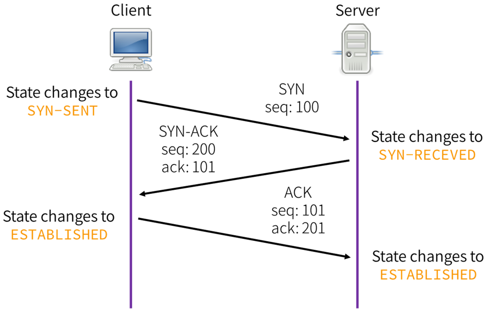
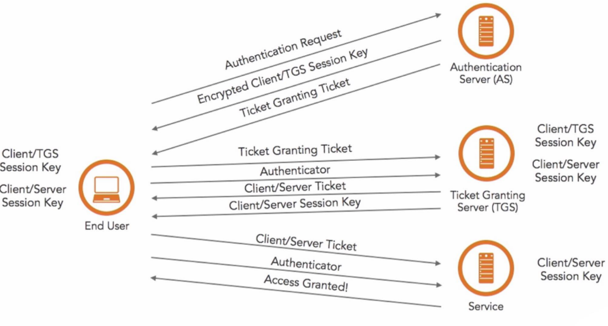

##### What is a three-way handshake? 

##### How do cookies work?

Data stored by the browser and sent to the server with every request. 

##### How do sessions work?

Collection of data stored on the server and associated with a given user (usually via a cookie containing an id code) 

##### What is SSL handshake?

##### How does HMAC work? 

##### Why HMAC is designed in that way? 

##### What’s the difference between Diffie-Hellman and RSA? 

RSA is a protocol which is used for signing or encryption, expect that you have all the key materials with you beforehand 

##### Diffie-Hellman is a protocol which is used for exchange of key. 

##### How does Kerberos work? 

##### If you're going to compress and encrypt a file, which do you do first and why? 

Compress the data first. 

This is because of encrypting a data we obtain a stream of bits which are random. Now, these random bits become impossible to be compressed, in other words, they are incompressible. 

The reason to why these random bits become incompressible is because of the lack of any patterned structure. 

Compressing data always requires any specific pattern to be compressed which is lacked in random bits. 