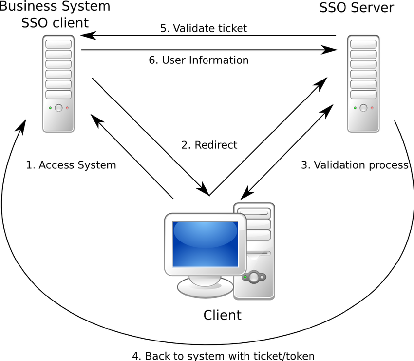

##### How does threat modeling work? 

Identify 

* Potential threat 

* Potential occurrence 

* Concern Priority 

* Means to eradicate or mitigate threat 

Categorized 

Analyze 

##### What is a subnet and how is it useful in security? 

You can control the flow of traffic using ACLs, QoS, or route-maps, enabling you to identify threats, close points of entry, and target your responses more easily. 

Limit access to resources on wireless clients, ensuring that valuable information isn’t easily accessible in remote locations. 

##### What is Traceroute? How does Traceroute work?

Small Time To Live (TTL) values are transmitted through packets via traceroute. This process prevents the packets from getting into loops. After the router subtracts from the given packet’s TTL, the packet immediately expires after the TTL reaches absolute zero. After that the sender is sent messages from Traceroute that exceed the time. When small values of TTL are used, the expiration happens quickly and thus the traceroute generates ICMP messages for identifying the router. 

##### Explain the difference between TCP and UDP. 

TCP guarantees the recipient will receive the packets in order by numbering them. 

When using UDP, packets are just sent to the recipient. The sender will not wait to make sure the recipient received the packet — it will just continue sending the next packets. 

##### Which is more secure? TCP or UDP? Why?

TCP, TCP has to make connection 

##### How do web certificates for HTTPS work? 

CA (Certificate Authority), CRL(Certificate Revocation List), Online Certificate Status Protocol (OCSP) 

##### Is ARP UDP or TCP? 

Neither 

##### How Single Sign-On works? 

##### What does nmap -sS do?

TCP SYN (Stealth) scan https://nmap.org/book/synscan.html

##### What does nmap -sT do?

TCP connect scan https://nmap.org/book/scan-methods-connect-scan.html

##### What port does ping work over? 

ICMP does not use ports 

##### Do you prefer filtered ports or closed ports on your firewall? Why?

##### How exactly does traceroute/tracert work at the protocol level? 

It actually keeps sending packets to the final destination; the only change is the TTL that’s used. The extra credit is the fact that Windows uses ICMP by default while Linux uses UDP. 

##### How does a buffer overflow work? 

##### How can one defend against buffer overflows? 

##### What are Linux’s strengths and weaknesses vs. Windows? 

##### Firewall 

A firewall is a device or service that acts as a gate keeper, deciding what enters and exits the network. It analyzes the traffic it sees passing through it by checking the packet headers and data. Based on its configuration, the firewall then decides accordingly whether to deny or allow traffic to pass through. 

##### IPS vs Firewall 

The primary function of a firewall is to prevent/control traffic flow from an untrusted network (outside). A firewall is not able to detect an attack in which the data is deviating from its regular pattern, whereas an IPS can detect and reset that connection as it has inbuilt anomaly detection 

##### NIDS 

NIDS (Network Intrusion Detection system) is a system that attempts to detect hacking activities, denial of service attacks or port scans on a computer network or a computer itself. The NIDS monitors network traffic and helps to detect these malicious activities by identifying suspicious patterns in the incoming packets. 

##### Rogue DHCP  

A rogue DHCP server can redirect IP address assignments to allow the hacker to identify and redirect the client computer to another network segment. The hacker can then sniff network traffic from the target machine 

##### ARP 

ARP (Address Resolution Protocol) is a protocol used for mapping an IP address to a computer connected to a local network LAN. Since each computer has a unique physical address called a MAC address, the ARP converts the IP address to the MAC address. This ensures each computer has a unique network identification. 

##### Common HTTP Attacks 

- SQL injection 
- URL interpretation 
- Impersonation 
- Buffer overflow 
- Session Hijacking 
- Cross-Site Scripting 

##### What is DDoS  ?

A malicious attempt to make a server or a network resource unavailable to users. 

It is achieved by saturating a service, which results in its temporary suspension or interruption. 

A Denial of Service (DoS) attack involves a single machine used to either target a software vulnerability or flood a targeted resource with packets, requests or queries. 

A Distributed Denial of Service (DDoS) attack, however, uses multiple connected devices—often executed by botnets or, on occasion, by individuals who have coordinated their activity. 

##### What is the need of DNS monitoring 

The Domain Name System (DNS) allots your website under a certain domain that is easily recognizable and also keeps the information about other domain names. 

It works like a directory for everything on the internet. 

Thus, DNS monitoring is very important since you can easily visit a website without actually having to memorize their IP address. 

##### Authoritative DNS Servers vs. Recursive DNS Servers 

Authoritative name servers store DNS record information –usually a DNS hosting provider or domain registrar. 

Recursive name servers are the “middlemen” between authoritative servers and end-users because they have to recuse up the DNS tree to reach the name servers authoritative for storing the domain’s records. 