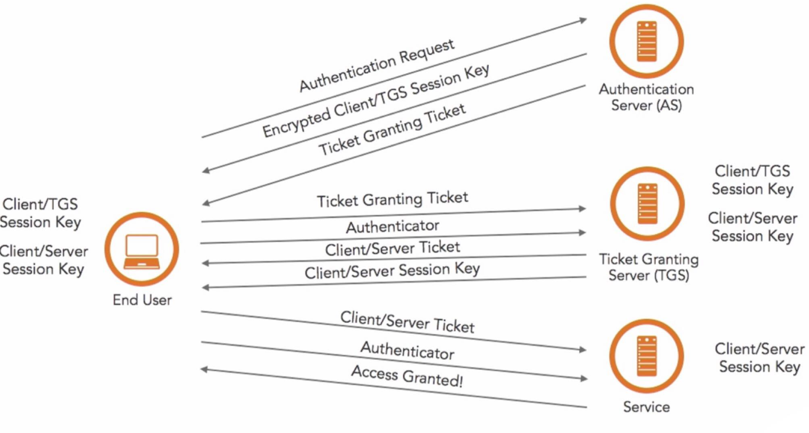

## Basic Encryption and Authentication
* What is a three-way handshake?
  
  * 
  
* How do cookies work? 

  * data stored by the browser and sent to the server with every request.

* How do sessions work? 

  * collection of data stored on the server and associated with a given user (usually via a cookie containing an id code)

* Describe SSL handshake.

* How does HMAC work?

* Why HMAC is designed in that way?

* What’s the difference between Diffie-Hellman and RSA?

  * RSA is a protocol which is used for signing or encryption, expect that you have all the key materials with you beforehand

  * Diffie-Hellman is a protocol which is used for exchange of key.

* How does Kerberos work?

  * 

* If you're going to compress and encrypt a file, which do you do first and why?

  * first compress the data. This is because of encrypting a data we obtain a stream of bits which are random. Now, these random bits become impossible to be compressed, in other words, they are incompressible. The reason to why these random bits become incompressible is because of the lack of any patterned structure. Compressing data always requires any specific pattern to be compressed which is lacked in random bits.

## Basic Network Level

* How does threat modeling work?

  * Identify

    * Potential threat

    * Potential occurrence

    * Concern Priority

    * Means to eradicate or mitigate threat

  * Categorized

  * Analyze

* What is a subnet and how is it useful in security?

  * you can control the flow of traffic using ACLs, QoS, or route-maps, enabling you to identify threats, close points of entry, and target your responses more easily.

  * limit access to resources on wireless clients, ensuring that valuable information isn’t easily accessible in remote locations.

* traceroute

  * Small Time To Live (TTL) values are transmitted through packets via traceroute. This process prevents the packets from getting into loops. After the router subtracts from the given packet’s TTL, the packet immediately expires after the TTL reaches absolute zero. After that the sender is sent messages from Traceroute that exceed the time. When small values of TTL are used, the expiration happens quickly and thus the traceroute generates ICMP messages for identifying the router.

* Explain the difference between TCP and UDP.

  * TCP guarantees the recipient will receive the packets in order by numbering them.

  * When using UDP, packets are just sent to the recipient. The sender will not wait to make sure the recipient received the packet — it will just continue sending the next packets.

  * Which is more secure? TCP

  * Why? TCP has to make connection

* How do web certificates for HTTPS work?

  * CA (Certificate Authority), CRL(Certificate Revocation List), Online Certificate Status Protocol (OCSP)

* Is ARP UDP or TCP?

  * Neither

* How Single Sign-On works?

* -sS TCP SYN scan:

* -sT TCP connect() scan:

## System Admin

* How do you change your DNS settings in Linux/Windows?

  * Windows: Internet adapter/

  * Linux: sudo nano /etc/resolv.conf add nameserver x.x.x.x

* Cyber Crime vs Cyber-enabled crime

  * Cyber-enabled crime: traditional crime that is amplified by the use of computer tech

  * Cyber Crime: illegal action involving network or computer where it used to commit the crime

* What is the main goal of information security within an organization or company?

  * Protect CIA

* What are the consequences of a cyber-attack?

* First step of securing Linux Server

  * Auditing: A system scan is performed using a tool called Lynis for auditing. Every category is scanned separately and the hardening index is provided to the auditor for further steps.

  * Hardening: After the audit is complete, the system is hardened depending on the level of security it further needs. It is an important process based on the decision of auditor.

  * Compliance: The system needs to be checked almost every day for better results and also lesser threats from security point of view.

* How to secure Web Server

  * Anti-virus and firewalls

  * Safe installation and configuration of the web server software

  * Secure installation and configuration of the O.S

  * Scanning system vulnerability

  * Remote administration disabling

  * Removing of unused and default account

  * Changing of default ports and settings to customs port and settings

  * Update/Patch the web server software

  * Update Permissions/Ownership of files

  * Delete default data/scripts

  * Remove or protect hidden files and directories

  * Web Application and Web Server Security

  * Minimize the server functionality disable extra modules

  * Increase logging verboseness

  * Configured to display generic error messages

  * Make sure Input Validation is enforced within the code: Security QA testing

  * Implement a software security policy

## Encryption

* SSL \ TLS \ HTTPS

  * SSL: standard technology for keeping an internet connection secure and safeguarding any sensitive data that is being sent between two systems, preventing criminals from reading and modifying any information transferred, including potential personal details.

  * TLS: cryptographic protocol that provides secure communication over the Internet. TLS protocol aims primarily to provide privacy and data integrity between two communicating computer applications.

  * HTTPS: secure version of HTTP, the protocol over which data is sent between your browser and the website that you are connected to. TLS and SSL are most widely recognized as the protocols that provide secure HTTP (HTTPS) for Internet transactions between Web browsers and Web servers.

  * HTTPS uses TCP at the transport layer. SSL is used for data encryption.

* **Does TLS use symmetric or asymmetric encryption?**

  * Both, initial exchange is done using asymmetric and that bulk data encryption requires speed and therefore symmetric algorithms.

* If someone steals the server’s private key can they decrypt all previous content sent to that server?

* **What are some common ways that TLS is attacked, and/or what are some ways it’s been attacked in the past?**

  * weak ciphers, vulnerabilities like Heartbleed, BEAST,

* **What is Forward Secrecy?**

  * a system that uses ephemeral session keys to do the actual encryption of TLS data so that even if the server’s private key were to be compromised, an attacker could not use it to decrypt captured data that had been sent to that server in the past.

* **Cryptographically speaking, what is the main method of building a shared secret over a public medium?**

  * Diffie-Hellman

* **What’s the difference between Diffie-Hellman and RSA?**

  * Diffie-Hellman is a key-exchange protocol, and RSA is an encryption/signing protocol. RSA required key material beforehand, DH does not

* **What kind of attack is a standard Diffie-Hellman exchange vulnerable to?**

  * MITM

* What’s the difference between encoding, encryption, and hashing?

* What is an IV used for in encryption?

* **What are block and stream ciphers? What are the differences, and when would you use one vs. the other?**

  * Block-based encryption algorithms work on a block of cleartext at a time, and are best used for situations where you know how large the message will be, e.g., for a file. Stream ciphers work on single units of cleartext, such as a bit or a byte, and they’re best used when you’re not sure how long the message will be.

* What are some examples of symmetric encryption algorithms?

  * DES, RCx, Blowfish, Rijndael (AES)

* What are some examples of asymmetric encryption algorithms?

  * Diffie Hellman, RSA, EC, El Gamal, DSAC

* **What are some common block cipher modes?**

  * ECB and CBC.

* **What’s the main difference in security between ECB and CBC?**

  * ECB just does a one-to-one lookup for encryption, without using an IV, which makes it fairly easy to attack using a chosen-plaintext attack. CBC uses an IV for the first block and then propagates the XOR of the previous block onto subsequent ones. The difference in results can be remarkable.

* What are the different ways in which the authentication of a person can be performed

  * Passwords: Something user know

  * Token: Something user have

  * Biometrics: Someone user is

  * OTP: one time password

## Network Security

* **What port does ping work over?**

  * ICMP No port

* Do you prefer filtered ports or closed ports on your firewall?

* **How exactly does traceroute/tracert work at the protocol level?**

  *  It actually keeps sending packets to the final destination; the only change is the TTL that’s used. The extra credit is the fact that Windows uses ICMP by default while Linux uses UDP.

* How does a buffer overflow work?

* How can one defend against buffer overflows?

* What are Linux’s strengths and weaknesses vs. Windows?

* Firewall

  * A firewall is a device or service that acts as a gate keeper, deciding what enters and exits the network. It analyzes the traffic it sees passing through it by checking the packet headers and data. Based on its configuration, the firewall then decides accordingly whether to deny or allow traffic to pass through.

* IPS vs Firewall

  * The primary function of a firewall is to prevent/control traffic flow from an untrusted network (outside). A firewall is not able to detect an attack in which the data is deviating from its regular pattern, whereas an IPS can detect and reset that connection as it has inbuilt anomaly detection

* NIDS

  * NIDS (Network Intrusion Detection system) is a system that attempts to detect hacking activities, denial of service attacks or port scans on a computer network or a computer itself. The NIDS monitors network traffic and helps to detect these malicious activities by identifying suspicious patterns in the incoming packets.

* Rogue DHCP 

  * A rogue DHCP server can redirect IP address assignments to allow the hacker to identify and redirect the client computer to another network segment. The hacker can then sniff network traffic from the target machine

* ARP

  * ARP (Address Resolution Protocol) is a protocol used for mapping an IP address to a computer connected to a local network LAN. Since each computer has a unique physical address called a MAC address, the ARP converts the IP address to the MAC address. This ensures each computer has a unique network identification.

* Common HTTP Attacks

  * SQL injection

  * URL interpretation

  * Impersonation

  * Buffer overflow

  * Session Hijacking

  * Cross-Site Scripting

* DDoS 

  * a malicious attempt to make a server or a network resource unavailable to users. It is achieved by saturating a service, which results in its temporary suspension or interruption. A Denial of Service (DoS) attack involves a single machine used to either target a software vulnerability or flood a targeted resource with packets, requests or queries. A DDoS attack, however, uses multiple connected devices—often executed by botnets or, on occasion, by individuals who have coordinated their activity.

* What is the need of DNS monitoring

  * The Domain Name System (DNS) allots your website under a certain domain that is easily recognizable and also keeps the information about other domain names. It works like a directory for everything on the internet. Thus, DNS monitoring is very important since you can easily visit a website without actually having to memorize their IP address.

* Authoritative DNS Servers vs. Recursive DNS Servers

  * Authoritative name servers store DNS record information –usually a DNS hosting provider or domain registrar. Recursive name servers are the “middlemen” between authoritative servers and end-users because they have to recuse up the DNS tree to reach the name servers authoritative for storing the domain’s records.

## Application Security

* Describe the last program or script that you wrote. What problem did it solve?

* How would you implement a secure login field on a high traffic website where performance is a consideration?

  * The answer you’re looking for here is that TLS is a must for the entire site at this point, and that there are very few situations where you shouldn’t insist on encryption.

* What are the various ways to handle account brute forcing?

  * account lockouts, IP restrictions, fail2ban, commercial versions thereof, etc.

* XSS, stored XSS, reflected XSS, DOM-based XSS

  * XSS: injects malicious code into a vulnerable web application. XSS differs from other web attack vectors (e.g., SQL injections), in that it does not directly target the application itself. Instead, the users of the web application are the ones at risk.

  * Stored XSS: also known as persistent XSS, is the more damaging of the two. It occurs when a malicious script is injected directly into a vulnerable web application. Stored Cross-site scripting vulnerabilities happens when the payload is saved, for example in a database and then is executed when a user opens the page. Stored cross-site scripting is very dangerous for a number of reasons:

  * Reflected XSS: Reflected XSS involves the reflecting of a malicious script off of a web application, onto a user’s browser. The script is embedded into a link, and is only activated once that link is clicked on. A reflected XSS vulnerability happens when the user input from a URL or POST data is reflected on the page without being stored. This means that an attacker has to send a crafted link or post form to the victim to insert the payload, and the victim should click the link. This kind of payload is also generally being caught by built in browser XSS filters, like in Chrome, Internet Explorer or Edge.

  * DOM-based XSS: an advanced type of XSS attack which is made possible when the web application’s client side scripts write user provided data to the Document Object Model (DOM). The data is subsequently read from the DOM by the web application and outputted to the browser. If the data is incorrectly handled, an attacker can inject a payload, which will be stored as part of the DOM and executed when the data is read back from the DOM.

* Prevention on XSS

  * Input Validation and Output Sanitization, with focus on the latter.

can be prevented by the use of the proper available sanitizers. Web developers have to have an eye on the gateways through which they receive information and these are the gateways which must be made as a barrier for malicious files. There are software or applications available for doing this, like the XSS Me for Firefox and DOM snitch for Google Chrome. Also, the default web application firewall formula, popularly

* What is Cross-Site Request Forgery CSRF?

* **How does one defend against CSRF?**

  * Nonce required by the server for each page or each request is an accepted, albeit not foolproof, method.

  * When CSRF attacks, you can opt for two available methods. Firstly, with every request try to include a random token. In this way a unique string of tokens will be generated which is a good safeguard. Secondly, for each field of form, try using different names. This will somewhat help you in becoming anonymous due to the entry of so many different names and thus will behave as a safeguard from CSRF attacks.

* What’s the difference between HTTP and HTML?

  * one is the networking/application protocol and the other is the markup language

* **How does HTTP handle state?**

  * It doesn’t. Not natively. Good answers are things like “cookies”, but the best answer is that cookies are a hack to make up for the fact that HTTP doesn’t do it itself.

* What is Exfiltration? Data Exfiltration

  * Infiltration is the method by which you enter or smuggle elements into a location. Exfiltration is just the opposite: getting sensitive information or objects out of a location without being discovered. In an environment with high security, this can be extremely difficult but not impossible. Again we turn to our friends in the fake delivery uniforms wandering around the building, and see that yes there are ways to get in and out without a lot of issues.

  * Data exfiltration or Data extrusion is the unauthorized transfer of data from a computer. The transfer of data can be manual by someone with physical access to the computer or automated, carried out through malware over a network. Because data routinely moves in and out of networked enterprises, data exfiltration can closely resemble normal network traffic, making detection of exfiltration attempts challenging for IT security groups.

## Risk

* What is the primary reason most companies haven’t fixed their vulnerabilities?

* What’s the goal of information security within an organization?

* If you were to start a job as head engineer or CSO at a Fortune 500 company due to the previous guy being fired for incompetence, what would your priorities be? Imagine you start on day one with no knowledge of the environment.

  * Where is the important data? Who interacts with it? Network diagrams. Visibility touch points. Ingress and egress filtering. Previous vulnerability assessments. What’s being logged an audited? Etc. The key is to see that they could quickly prioritize, in just a few seconds, what would be the most important things to learn in an unknown situation.

* As a corporate Information Security professional, what’s more important to focus on: threats or vulnerabilities?

  * vulnerabilities should usually be the main focus since we in the corporate world usually have little control over the threats.

  * threats (in terms of vectors) will always remain the same, and that the vulnerabilities we are fixing are only the known ones. Therefore we should be applying defense-in-depth based on threat modeling in addition to just keeping ourselves up to date.

## Industry Wisdom

* Vulnerability vs Risk

  * Vulnerability: A vulnerability is a weakness in a system or application that may be exploited to violate that specific system without any context to the impact involved. Vulnerability refers to the security flaws in or a computer or system that allow an attack to be successful. A successful compromise of a vulnerability may result in data manipulation, code execution, data loss etc.

  * Risk: Risk is the intersection of threats, assets, and vulnerabilities. The potential for loss, damage or destruction of an asset as a result of a threat exploiting a vulnerability. Risk is essentially the level of possibility that an action will lead to lead to a loss or to an undesired outcome. The risk may even pay off and not lead to a loss, it may lead to a gain. A risk assessment is performed to determine the most important potential security breaches to address now, rather than later.

* Threat vs Exploit

  * Threat: A threat is what we’re trying to protect against. A potential danger to the machine system. It describes something that a company doesn’t want to happen. The successful exploitation of the vulnerability is a threat. A threat may be a malicious attacker who is attempting to obtain unauthorized access to an asset. Natural or man-made occurrence, individual, entity, or action that has or indicates the potential to harm life, information, operations, the environment and/or property.

  * Exploit: The exploit is something that takes advantage of vulnerability in an asset to generate unintended or unexpected behavior in the target system, which would enable an attacker to get access to data or information.

* What is Open Source Software

  * Open source software is software with source code that anyone can inspect, modify, and enhance. Programmers who have access to a computer program’s source code can improve that program by adding features to it or fixing parts that don’t always work correctly.

* What is more secure? Open source project or proprietary project?

  * The securities of these projects depend mainly on the size of the project, the total number of the developers who are working under this project and the one factor, which is most essential as well as important, is the control of the quality. Just the type of project won’t determine its quality, the inside matter of the corresponding projects will matter.

* Where do you get your security news from?

* What are the advantages offered by bug bounty programs over normal testing practices?

  * You should hear coverage of many testers vs. one, incentivization, focus on rare bugs, etc.

* How would you measure how well a security team is doing?

  * Here we’re looking for them to ask us questions in return, such as, “What kind of team?” Answers that are bad include anything purely number-based like number of IDS events, or widget-thingies detected. 

* Who’s more dangerous to an organization, insiders or outsiders?

* Vulnerability Assessment vs Penetration Testing

  * Vulnerability Assessment is an approach used to find flaws in an application/network whereas Penetration testing is the practice of finding exploitable vulnerabilities like a real attacker will do. VA is like travelling on the surface whereas PT is digging it for gold.

* Chain of Custody

  * protocol for handling physical proof that will be introduced in a courtroom, ensuring evidence complies with the rules of criminal procedure. When keeping track of data or equipment for use in legal proceedings, it needs to remain in a pristine state. Therefore, documenting exactly who has had access to what for how long is vital when dealing with this situation. Any compromise in the data can lead to legal issues for the parties involved and can lead to a mistrial or contempt depending on the scenario

## Innovation Questions

* What are the primary design flaws in HTTP, and how would you improve it?

* If you could re-design TCP, what would you fix?

* What is the one feature you would add to DNS to improve it the most?

* What is likely to be the primary protocol used for the Internet of Things in 10 years?

* If you had to get rid of a layer of the OSI model, which would it be?

* You can ask infinite variations of these, of course. Asking for three options instead of one, or asking them to rank the results, etc.

## Other Top Questions

* Tell me about a project you worked on in the past that you really enjoyed.

* What was challenging about it?

* Why did you choose to approach it the way you did vs. (list alternatives)

* If you could have the perfect job and the perfect manager, what would that look like? What you do day to day, and what kind of projects would you have?

* What is a skill you wish you had but don’t yet have?

* How are you working to get that skill?

* What do you think the most important technology is right now?

* How are we going to secure it?

 