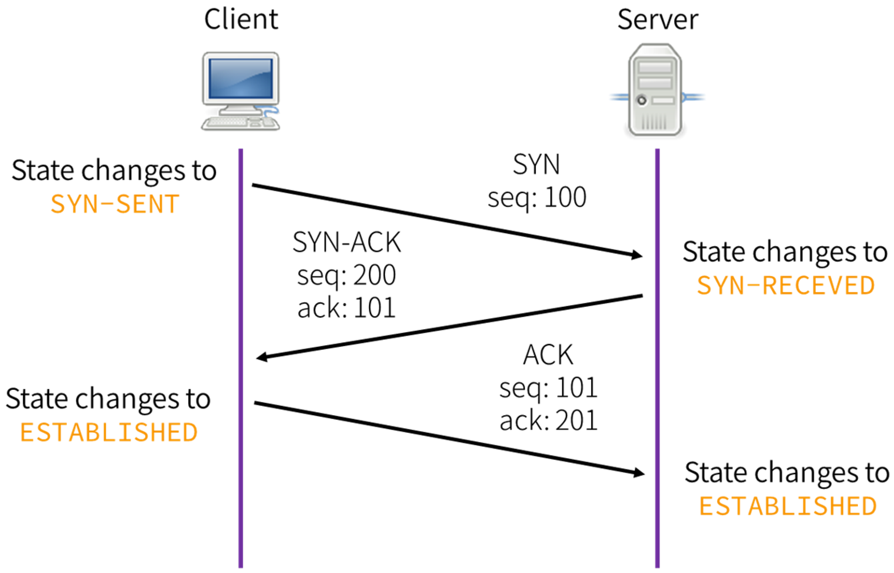
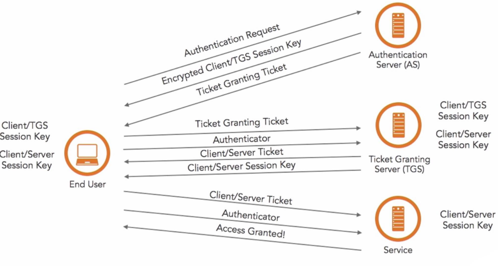

# Basic Encryption and Authentication

### What is a three-way handshake? 

The TCP connection-setup exchange: the client sends `SYN`, the server replies `SYN-ACK`, and the client answers `ACK`. This synchronizes sequence numbers and confirms both sides can send and receive before any data flows.

### How do cookies work?

Data stored by the browser and sent to the server with every request.  Client side.

### How do sessions work?

Collection of data stored on the server and associated with a given user (usually via a cookie containing an id code) 

### What is SSL handshake?

The negotiation that sets up a TLS session: client and server agree on the protocol version and cipher suite, the server presents its certificate (proving identity), they establish a shared symmetric session key (via RSA key transport or, preferably, ephemeral Diffie-Hellman for forward secrecy), and then switch to fast symmetric encryption for the actual data.

### How does HMAC work? 

HMAC (Hash-based Message Authentication Code) proves both the integrity and authenticity of a message using a shared secret key K and a hash function H. It is defined as `HMAC(K, m) = H((K XOR opad) || H((K XOR ipad) || m))`, where K is padded to the hash's block size and `ipad`/`opad` are the constants `0x36` and `0x5c` repeated. Sender and receiver share K; the receiver recomputes the HMAC over the received message and compares it (in constant time) to the tag that was sent.

### Why HMAC is designed in that way? 

The nested, two-pass construction (hash with the inner key, then hash that result with the outer key) defends against length-extension attacks that affect Merkle-Damgard hashes such as MD5, SHA-1, and SHA-256. A naive `H(key || message)` MAC is forgeable because an attacker can extend the message without knowing the key; wrapping the inner digest in an outer keyed hash prevents that. HMAC is also provably secure as a MAC/PRF as long as the underlying compression function behaves like a PRF, which is why it stays safe even with hashes (like SHA-1) whose collision resistance is broken.

### What’s the difference between Diffie-Hellman and RSA? 

RSA is a protocol which is used for signing or encryption, except that you have all the key materials with you beforehand 

Diffie-Hellman is a protocol which is used for exchange of key.

### How does Kerberos work? 

A ticket-based authentication protocol built around a trusted Key Distribution Center (KDC). The client authenticates once to the Authentication Server and receives a Ticket-Granting Ticket (TGT); to reach a service it presents the TGT to the Ticket-Granting Server and gets a service ticket, which it hands to the target service. Passwords are never sent over the wire, and tickets are timestamped to limit replay — which is why Kerberos is sensitive to clock skew between hosts.

### If you're going to compress and encrypt a file, which do you do first and why? 

Compress the data first. 

This is because of encrypting a data we obtain a stream of bits which are random. Now, these random bits become impossible to be compressed, in other words, they are incompressible. 

The reason to why these random bits become incompressible is because of the lack of any patterned structure. 

Compressing data always requires any specific pattern to be compressed which is lacked in random bits. 

### Authentication Related

#### Auth systems 

SAML 2.0.

OpenID.

#### Biometrics

Can't rotate unlike passwords.

#### Password management

Rotating passwords (and why this is bad). 

Different password lockers. 

#### U2F / FIDO

Eg. Yubikeys.

Helps prevent successful phishing of credentials.

#### Compare and contrast multi-factor auth methods

MFA combines factors from different categories — something you know (password/PIN), have (phone, hardware token), or are (biometric).
- **SMS/email OTP:** easy, but phishable and vulnerable to SIM-swapping and interception.
- **TOTP apps (Google Authenticator/Authy):** offline codes, better than SMS, but still phishable if the user types the code into a fake site.
- **Push approval:** convenient, but prone to "MFA fatigue" prompt-bombing.
- **Hardware security keys (U2F/FIDO2, e.g. YubiKey):** strongest — origin-bound public-key auth that resists phishing because the key will not sign for a look-alike domain.
- **Biometrics:** convenient and hard to guess, but cannot be rotated once compromised, so best used as a local unlock rather than a shared secret.