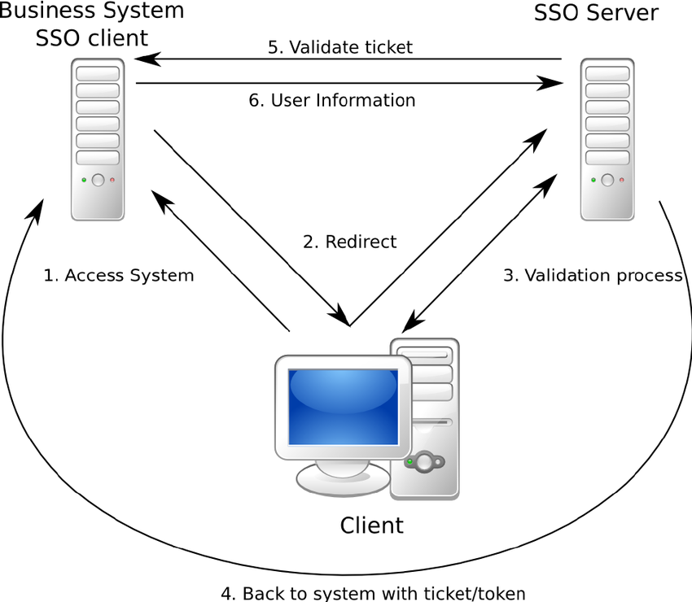

# Basic Network and Network Security

### OSI Model

- Application; layer 7 (and basically layers 5 & 6) (includes API, HTTP, etc.)
- Transport; layer 4 (TCP/UDP)
- Network; layer 3 (Routing)
- Datalink; layer 2 (Error checking and frame synchronization)
- Physical; layer 1 (Bits over fiber)

### Common Protocols and Ports

- HTTP/S
  - Port 80, 443

- SSL/TLS
  - Port 443
  - Super important to learn this, includes learning about handshakes, encryption, signing, certificate authorities, trust systems. [A good primer on all these concepts and algorithms](https://english.ncsc.nl/publications/publications/2019/juni/01/it-security-guidelines-for-transport-layer-security-tls) is made available by the Dutch cybersecurity center.
  - Various attacks against older versions of SSL/TLS (with catchy names) on [Wikipedia](https://en.wikipedia.org/wiki/Transport_Layer_Security#Attacks_against_TLS/SSL)

- ICMP
  - Ping and traceroute

- Mail
  - SMTP ( Port 25, 587, 465)
  - IMAP (Port 143, 993)
  - POP3 (Port 110, 995)

- SSH
  - Port 22
  - Handshake uses asymmetric encryption to exchange symmetric key

- Telnet
  - Port 23, 992
  - Allows remote communication with hosts

- ARP
  - Who is 0.0.0.0? Tell 0.0.0.1.
  - Pairing MAC address with IP Address for IP connections. Looks at cache first.
  - A protocol used for mapping an IP address to a computer connected to a local network LAN. Since each computer has a unique physical address called a MAC address, the ARP converts the IP address to the MAC address. This ensures each computer has a unique network identification.
  - Is ARP UDP or TCP? Neither

- DHCP
  - Port 67, 68, 546, 547
  - Automatic (leases IP address and remembers MAC and IP pairing in a table)
  - Manual (static IP set by administrator)
  - Dynamic (leases IP address, not persistent. Allocated by router).
  - `DHCPDISCOVER` -> `DHCPOFFER` -> `DHCPREQUEST` -> `DHCPACK`
  - Rogue DHCP: A rogue DHCP server can redirect IP address assignments to allow the hacker to identify and redirect the client computer to another network segment. The hacker can then sniff network traffic from the target machine

- IRC
  - Understand use by hackers (botnets)

- FTP/SFTP
  - port 21, 22

- RPC
  - Predefined set of tasks that remote clients can execute
  - Used inside orgs

- Service ports
  - 0 - 1023: Reserved for common services - sudo required
  - 1024 - 49151: Registered ports used for IANA-registered services
  - 49152 - 65535: Dynamic ports that can be used for anything

### TCP / UDP

#### Explain the difference between TCP and UDP.

TCP guarantees the recipient will receive the packets in order by numbering them.

When using UDP, packets are just sent to the recipient. The sender will not wait to make sure the recipient received the packet — it will just continue sending the next packets.

#### Which is more secure? TCP or UDP? Why?

TCP, TCP has to make connection

### DNS

Port 53

Requests to DNS are usually UDP, unless the server gives a redirect notice asking for a TCP connection. Look up in cache happens first. DNS exfiltration. Using raw IP addresses means no DNS logs, but there are HTTP logs. DNS sinkholes.

In a reverse DNS lookup, PTR might contain- 2.152.80.208.in-addr.arpa, which will map to  208.80.152.2. DNS lookups start at the end of the string and work backwards, which is why the IP address is backwards in PTR.

#### DNS exfiltration

- Sending data as subdomains
- 26856485f6476a567567c6576e678.badguy.com
- Doesn’t show up in http logs

#### DNS configs

- Start of Authority (SOA)
- IP addresses (A and AAAA)
- SMTP mail exchangers (MX)
- Name servers (NS)
- Pointers for reverse DNS lookups (PTR)
- Domain name aliases (CNAME)

#### What is the need of DNS monitoring

The Domain Name System (DNS) allots your website under a certain domain that is easily recognizable and also keeps the information about other domain names.

It works like a directory for everything on the internet.

Thus, DNS monitoring is very important since you can easily visit a website without actually having to memorize their IP address.

#### Authoritative DNS Servers vs. Recursive DNS Servers

Authoritative name servers store DNS record information –usually a DNS hosting provider or domain registrar.

Recursive name servers are the “middlemen” between authoritative servers and end-users because they have to recurse up the DNS tree to reach the name servers authoritative for storing the domain’s records.

#### What is DNS spoofing (cache poisoning)? How does it work?

An attacker gets a DNS resolver to cache a forged record so a domain resolves to an attacker-controlled IP. Because classic DNS runs over UDP with no authentication, an attacker who can guess or observe the query's transaction ID and source port — or simply win the race against the real answer — can send a forged response that the resolver accepts and caches. Every user of that resolver is then redirected until the record's TTL expires. Mitigations: DNSSEC (cryptographically signed records), randomized source ports and transaction IDs, and 0x20-bit query encoding.

### What is a subnet and how is it useful in security?

You can control the flow of traffic using ACLs, QoS, or route-maps, enabling you to identify threats, close points of entry, and target your responses more easily.

Limit access to resources on wireless clients, ensuring that valuable information isn’t easily accessible in remote locations.

### What port does ping work over?

ICMP does not use ports

### Firewall / IPS / IDS

Rules to prevent incoming and outgoing connections.

A firewall is a device or service that acts as a gate keeper, deciding what enters and exits the network. It analyzes the traffic it sees passing through it by checking the packet headers and data. Based on its configuration, the firewall then decides accordingly whether to deny or allow traffic to pass through.

#### Do you prefer filtered ports or closed ports on your firewall? Why?

Filtered (silently dropped, no reply) is generally preferred over closed (which sends a TCP RST or ICMP unreachable). A closed port still answers, confirming the host is up and the port reachable; a filtered port returns nothing, so a scanner learns less and must wait for timeouts, slowing reconnaissance. The trade-off is that dropping everything can complicate legitimate network troubleshooting.

#### IPS vs Firewall

The primary function of a firewall is to prevent/control traffic flow from an untrusted network (outside). A firewall is not able to detect an attack in which the data is deviating from its regular pattern, whereas an IPS can detect and reset that connection as it has inbuilt anomaly detection

#### NIDS

NIDS (Network Intrusion Detection system) is a system that attempts to detect hacking activities, denial of service attacks or port scans on a computer network or a computer itself. The NIDS monitors network traffic and helps to detect these malicious activities by identifying suspicious patterns in the incoming packets.

### HTTP

#### HTTP Header

- | Verb | Path | HTTP version |
- Domain
- Accept
- Accept-language
- Accept-charset
- Accept-encoding(compression type)
- Connection- close or keep-alive
- Referrer
- Return address
- Expected Size?

#### HTTP Response Header

- HTTP version
- Status Codes:
  - 1xx: Informational Response
  - 2xx: Successful
  - 3xx: Redirection
  - 4xx: Client Error
  - 5xx: Server Error
- Type of data in response
- Type of encoding
- Language
- Charset

#### Common HTTP Attacks

- SQL injection
- URL interpretation
- Impersonation
- Buffer overflow
- Session Hijacking
- Cross-Site Scripting

### What is DDoS  ?

A malicious attempt to make a server or a network resource unavailable to users.

It is achieved by saturating a service, which results in its temporary suspension or interruption.

A Denial of Service (DoS) attack involves a single machine used to either target a software vulnerability or flood a targeted resource with packets, requests or queries.

A Distributed Denial of Service (DDoS) attack, however, uses multiple connected devices—often executed by botnets or, on occasion, by individuals who have coordinated their activity.

### Traceroute

Usually uses UDP, but might also use ICMP Echo Request or TCP SYN. TTL, or hop-limit.

Initial hop-limit is 128 for windows and 64 for *nix. With the default UDP probes, the destination returns an ICMP Port Unreachable (Destination Unreachable); intermediate hops return ICMP Time Exceeded. The ICMP variant (e.g. Windows tracert) gets an ICMP Echo Reply from the destination instead.

#### How does Traceroute work?

Small Time To Live (TTL) values are transmitted through packets via traceroute. This process prevents the packets from getting into loops. After the router subtracts from the given packet’s TTL, the packet immediately expires after the TTL reaches absolute zero. After that the sender is sent messages from Traceroute that exceed the time. When small values of TTL are used, the expiration happens quickly and thus the traceroute generates ICMP messages for identifying the router.

#### How exactly does traceroute/tracert work at the protocol level?

It actually keeps sending packets to the final destination; the only change is the TTL that’s used. The extra credit is the fact that Windows uses ICMP by default while Linux uses UDP.

### Nmap

Network scanning tool

#### What does nmap -sS do?

TCP SYN (Stealth) scan https://nmap.org/book/synscan.html

#### What does nmap -sT do?

TCP connect scan https://nmap.org/book/scan-methods-connect-scan.html

### Certificate

Look at DigiNotar.

### What info do certs contain, how are they signed?

An X.509 certificate contains the subject (CN and Subject Alternative Names), the subject's public key, the issuer, a validity period (not-before/not-after), a serial number, key-usage/extended-key-usage constraints, and the issuing CA's signature. Signing: the CA hashes the certificate's to-be-signed contents and signs that hash with the CA's private key. A client verifies by re-hashing the same contents and checking the signature with the CA's public key, chaining up through any intermediates to a root CA already trusted in its root store.

#### How do web certificates for HTTPS work?

CA (Certificate Authority), CRL(Certificate Revocation List), Online Certificate Status Protocol (OCSP)

#### What is certificate pinning?

The client hard-codes ("pins") the exact certificate or public key (often as a hash) it expects from a server and rejects any other, even one validly issued by a trusted CA. This defends against a rogue or compromised CA issuing a fraudulent certificate for the domain, and is common in mobile apps. The downside is operational: if the pinned key rotates without a client update, connections break — which is why HTTP-header pinning (HPKP) was deprecated.

#### What is Certificate transparency ?

Can verify certificates against public logs

### How Single Sign-On works?

Bearer tokens, this can be stolen and used, just like cookies.

### NAT

Useful to understand IPv4 vs IPv6.

### Multiplex

Timeshare, statistical share, just useful to know it exists.

### Intercepts (MITM)

Understand PKI (public key infrastructure in relation to this).

### VPN

Hide traffic from ISP but expose traffic to VPN provider.

### Tor

Traffic is obvious on a network.

How do organized crime investigators find people on tor networks.

### Proxy

Why 7 proxies won’t help you.

### BGP

Border Gateway Protocol.

Holds the internet together.

### Network traffic tools

Wireshark

Tcpdump

Burp suite

### UDP Header

Source port

Destination port

Length

Checksum

### Broadcast domains and collision domains.

A collision domain is a network segment where simultaneous transmissions can collide (as on old shared hubs); a switch places each port in its own collision domain. A broadcast domain is the set of devices that receive one another's broadcast frames; a router (or a separate VLAN) bounds a broadcast domain. In short: switches break up collision domains, routers/VLANs break up broadcast domains.

### Root stores

The set of trusted root CA certificates shipped with an OS or browser. A TLS certificate is trusted only if its chain terminates at a root in this store. Whoever controls the root store controls trust decisions, so additions and removals (e.g. distrusting a misbehaving CA) are security-critical.

### CAM table overflow

An attack on a switch's CAM (MAC-address) table: the attacker floods the switch with frames using many bogus source MAC addresses until the finite table fills. The switch then fails open, flooding subsequent frames out every port like a hub, letting the attacker sniff traffic. Mitigated by port security (limiting the number of MACs learned per port).
